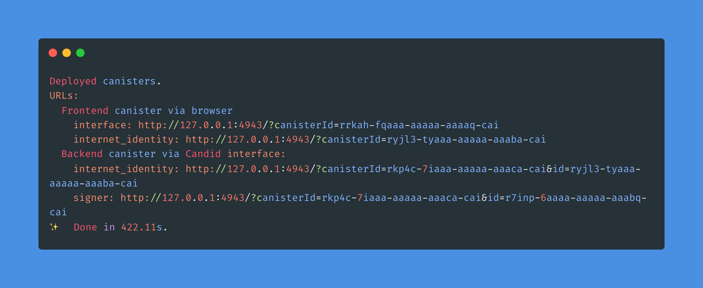

# Demo: Uniswap UI on the Internet Computer with canister-based Signer

## Overview

Canister smart contracts on the [Internet Computer](https://internetcomputer.org)(IC) can serve web applications directly to browsers. This can be utilized by protocols built on other blockchain platforms to host user interfaces reliably and securely. This example demonstrates this for the open-source [Uniswap interface](https://github.com/Uniswap/interface) to interact with the Uniswap protocol. The cool thing: Having the user interface on the Internet Computer can enable the autonomous upgrading of interfaces controlled by a DAO.

Furthermore, this example includes the usage of a simple canister-based signer, where signatures can be authorized using [WebAuthn](https://webauthn.io/), and the signatures are created by the Internet Computer using [Chain-key signatures](https://internetcomputer.org/docs/current/developer-docs/integrations/t-ecdsa/)(threshold ECDSA). The implementation is simplified and shouldn't be used with main net tokens, since there is no guarantee that this canister-based signer will not run out of cycles. Also, there's currently no way to transfer funds to another wallet. The only thing you can do is swap tokens on Uniswap.

## Usage demo

https://user-images.githubusercontent.com/1970182/219301859-74a3403f-010a-4fb6-824b-529abd047db7.mp4

https://twitter.com/dominic_w/status/1574546360418070528

[Presentation at DFINITY Global R&D](https://www.youtube.com/live/Q9FJtye_-6E?feature=share&t=2823)

## Build & Deploy

### Prerequisites

- [dfx](https://internetcomputer.org/docs/current/developer-docs/setup/install/) 
- node v14.18.0 (I recommend using [nvm](https://github.com/nvm-sh/nvm))
- [yarn](https://yarnpkg.com/getting-started/install)

### Infura API Keys

Before you start you need to get an API from [Infura](https//infura.io) and add it to line 19 of `/src/interface/src/internet-computer/index.ts`.

```js
const INFURA_API_KEY = "Enter your API key here";
```

### Build & Deploy to local node

```bash
dfx start --clean
yarn run setup
```

This will start a local Internet Computer node and deploy the project to the local node.
After a while, you should see something like



and you can navigate your browser to the (Uniswap) interface: `http://127.0.0.1:4943/?canisterId=rrkah-fqaaa-aaaaa-aaaaq-cai` (in this case).


### Live Reload

To start the UI in a dev server with hot-reload use
```bash
yarn run start
```

### Deploy to IC

To deploy to the Internet Computer (i.e. mainnet), you'll first need some cycles to pay for the deployment. The simplest way to do this is to get a coupon from the [cycles faucet](https://faucet.dfinity.org). More info on how to get cycles can be found in the [docs](https://internetcomputer.org/docs/current/developer-docs/setup/cycles/).

If you've set up a cycles wallet with some cycles, you can use the following commands to deploy the interface and the signing canister to the IC:

```bash
dfx deploy --network ic signer --argument '(opt variant { Production } )'
dfx deploy interface
```

The install argument is required since the threshold ECDSA keys provided by the Internet Computer have different names on the local node and on the IC.


## Live Deployment

I've deployed the project to the IC. You can interact with the Uniswap interface at:
```
https://yrog5-xqaaa-aaaap-qa5za-cai.ic0.app/
```

If you want to swap some tokens, you'll need testnet (Goerli) ETH in your canister wallet first. You can request testnet ETH at http://goerlifaucet.com.

You can interact with the deployed version of the signer using Candid UI at:
```
https://a4gq6-oaaaa-aaaab-qaa4q-cai.raw.ic0.app/?id=ywpaj-2iaaa-aaaap-qa5zq-cai
```
## Architecture


### Static UI in asset canister

The open-source interface is built and uploaded to an asset canister on the Internet Computer. The relevant configuration can be seen in the [`dfx.json`](./dfx.json) configuration:

```js
"frontend": {
      "frontend": {
        "entrypoint": "build/index.html"
      },
      "source": ["build"],
      "type": "assets"
    },
```
An asset canister serves certified assets, i.e. a client can verify the authenticity of the assets. Since browsers don't have native support for the certification protocol the Internet Computer uses, a service worker served by the Boundary Nodes of the Internet Computer verifies the certification currently. 

### Internet Computer Provider Implementation

To demonstrate the canister-based signer, we implemented an [EIP-1193](https://eips.ethereum.org/EIPS/eip-1193) compatible provider. The provider mostly uses an Infura RPC provider under the hood, but interacts with the signer canister to get the Ethereum account and to sign transactions. Furthermore, the provider uses Internet Identity to authenticate the user to the signer canister, such that each user controls a unique Ethereum account.

The code can be found in [`/src/internet-computer/index.ts`](/src/internet-computer/index.ts).


### Internet Identity

We use Internet Identity for secure authentication to the signer canister. Internet Identity is a service deployed to the Internet Computer. For local testing, we need to set up the service locally. The relevant configuration can be seen in the [`dfx.json`](./dfx.json) configuration:

```js
"internet_identity": {
    "type": "custom",
    "candid": "https://github.com/dfinity/internet-identity/releases/latest/download/internet_identity.did",
    "wasm": "https://github.com/dfinity/internet-identity/releases/latest/download/internet_identity_dev.wasm.gz",
    "remote": {
        "id": {
          "ic": "rdmx6-jaaaa-aaaaa-aaadq-cai"
        }
    },
    "frontend": {}
}
```

### Canister Signer

The canister signer uses the threshold ECDSA interface of the IC to provide an Ethereum address and signing capabilities to each user of the canister. Each user gets a unique public key that corresponds to an Ethereum address and each user can demand signatures signed with the corresponding private key. 

The code is based on the [threshold ECDSA example](https://internetcomputer.org/docs/current/samples/t-ecdsa-sample). For a more complete example of a canister-based wallet have a look at [ic-evm-sign](https://www.tzionis.com/projects/ic-evm-sign).

For production wallets, check out [AstroX Me](https://astrox.me/) and [NFID](https://nfid.one/).